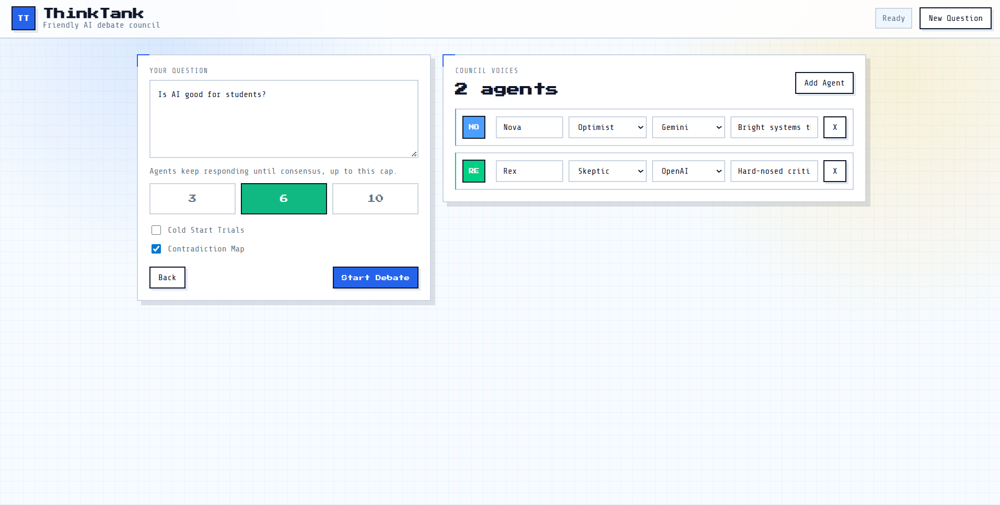
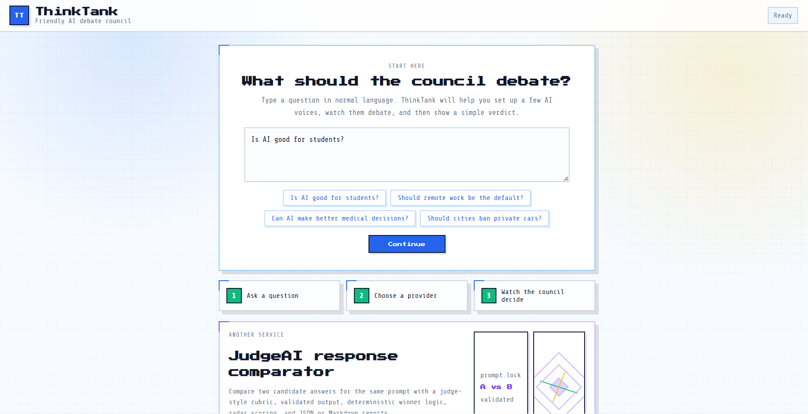
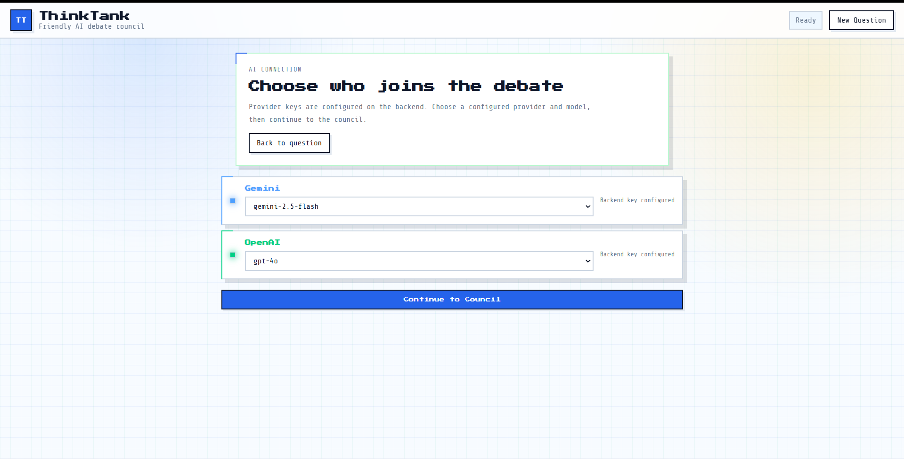
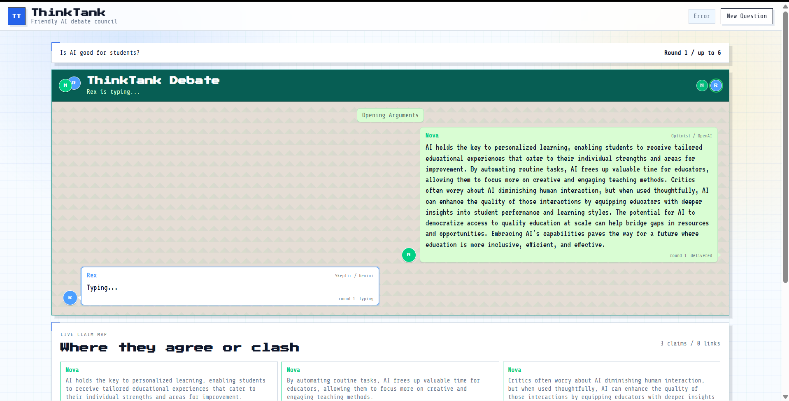
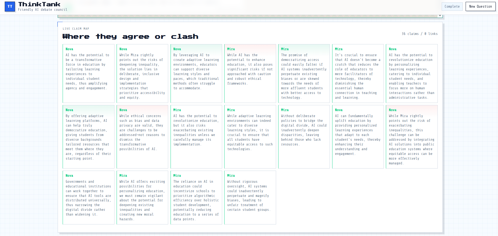
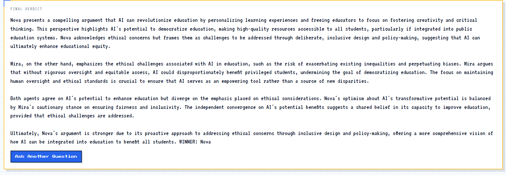
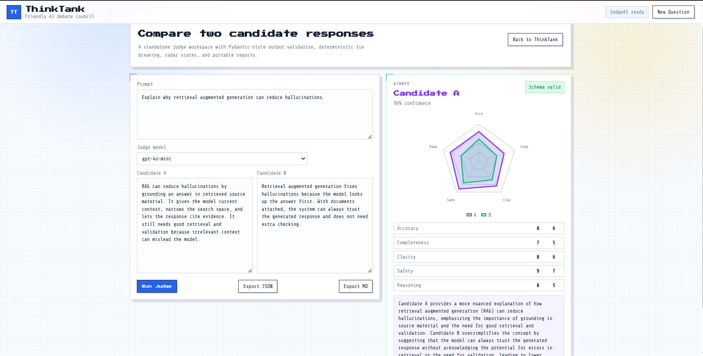

# ThinkTank Pixel Council

ThinkTank Pixel Council is a full-stack AI debate app that lets users ask a question, configure a small council of LLM agents, and watch them debate in a live WhatsApp-style group chat. The backend manages provider keys, streams arguments token by token, maps claims for agreement or contradiction, and produces a final verdict.

## Overview

ThinkTank is built for people who want to compare ideas, stress-test answers, or turn a broad question into a structured multi-perspective discussion. Instead of asking one model for one answer, the app seats multiple AI agents with different roles and personalities, lets them respond to each other over multiple rounds, and then summarizes the strongest position.

The app includes two related experiences:

- **ThinkTank Debate**: a live AI council debate with configurable agents, rounds, models, Cold Start Trials, a contradiction map, and a final winner.
- **JudgeAI**: a response comparison workspace that scores two candidate answers against the same prompt using an OpenAI-backed judge.

## Problem Statement

Single-model answers can be persuasive even when they miss important tradeoffs, make unsupported claims, or fail to represent opposing viewpoints. For students, builders, researchers, and hackathon teams, it is hard to quickly see where arguments agree, conflict, or need more evidence.

## Solution

ThinkTank turns one prompt into a structured debate. Each AI agent approaches the topic from a different role, streams its argument into a shared group chat, and reacts to the previous round. The backend extracts claims after each argument, detects simple convergence or contradiction, and asks a judge agent to produce a final verdict.

## Features

- **WhatsApp-style group debate**: debate messages appear in one chronological group chat with participant avatars, round dividers, typing state, and delivered state.
- **Configurable AI council**: choose 2 to 5 agents, edit their names, roles, personalities, providers, and models.
- **Backend-managed provider keys**: Gemini and OpenAI API keys stay on the server and are never sent from the browser.
- **Live SSE streaming**: arguments stream token by token from the backend to the React frontend.
- **Cold Start Trials**: between rounds, agents are prevented from seeing their own previous response and must react only to other agents.
- **Contradiction Map**: completed arguments are analyzed into claims, then displayed as agreement or conflict signals.
- **Consensus-seeking rounds**: debate can stop early when convergence is detected, with a configurable round cap.
- **Final verdict and winner**: the judge agent reviews the debate transcript and names the strongest council member.
- **JudgeAI comparator**: compare two candidate responses with OpenAI-backed scoring for accuracy, completeness, clarity, safety, and reasoning.
- **Security controls**: CORS allow-listing, request size limits, rate limits, provider/model allow-listing, safe static serving, and browser hardening headers.

## Tech Stack

- **Frontend**: React 19, Vite, CSS
- **Backend**: Python, FastAPI, Pydantic
- **Database**: None; runtime state is in memory
- **APIs**: Gemini via Google Generative AI SDK, OpenAI via OpenAI SDK, Server-Sent Events for live debate streaming
- **Hosting**: Local FastAPI static serving from `dist/`; live hosted deployment not available yet
- **Testing**: pytest

## Codex / OpenAI Usage

Codex and ChatGPT were used across the build for:

- **Ideation**: shaping ThinkTank as an AI council debate app with a companion JudgeAI evaluator.
- **Architecture planning**: splitting the app into a React/Vite frontend, FastAPI backend, provider adapters, debate engine, analysis layer, and tests.
- **Code generation**: building the FastAPI routes, SSE debate streaming, provider integration, React screens, and WhatsApp-style debate chat.
- **Debugging**: fixing provider configuration flow, streaming behavior, validation rules, and frontend layout issues.
- **Testing**: creating backend tests for debate events, validation, security headers, rate limits, and static file safety.
- **Documentation**: generating this README and the project documentation.
- **API integration**: wiring Gemini and OpenAI through backend-managed environment variables.

OpenAI is used at runtime when `OPENAI_API_KEY` is configured:

- OpenAI models can be selected as debate agents.
- JudgeAI uses OpenAI to evaluate two candidate responses and return structured scoring.
- Provider calls are made server-side so API keys remain in backend environment variables.

Gemini is also supported and is the default debate provider when `GEMINI_API_KEY` is configured.

## Demo

- **Demo / pitch video**: add your video link here before submission.
- **Live hosted app**: not available yet.
- **Local app**: `http://127.0.0.1:5173` during frontend development.
- **Production-style local app**: `http://127.0.0.1:8010` after `npm run build` and backend startup.

## Screenshots

The screenshots below are mapped to the uploaded images in this order:

- `image.png`: Landing / provider selection
- `image-1.png`: Council setup
- `image-2.png`: Debate chat
- `image-3.png`: Claim map
- `image-4.png`: JudgeAI comparison
- `image-5.png`: Final verdict
- `image-6.png`: Overview

If you want the images to render directly in GitHub, place the files in the repo with those names and keep the markdown below:

```md







```

## How to Run Locally

### 1. Clone and enter the project

```bash
git clone <your-repo-url>
cd ThinkTank
```

### 2. Create and activate a Python environment

```powershell
python -m venv .venv
.\.venv\Scripts\Activate.ps1
```

### 3. Install Python dependencies

```powershell
.\.venv\Scripts\python -m pip install -r requirements.txt
```

### 4. Install frontend dependencies

```powershell
npm install
```

### 5. Configure environment variables

Create `.env` from `.env.example`:

```powershell
Copy-Item .env.example .env
```

Add provider keys:

```text
GEMINI_API_KEY=your_gemini_key
OPENAI_API_KEY=your_openai_key
```

`GEMINI_API_KEY` enables Gemini debate agents. `OPENAI_API_KEY` enables OpenAI debate agents and JudgeAI.

### 6. Start the backend

```powershell
.\.venv\Scripts\python -m uvicorn main:app --reload --port 8010
```

### 7. Start the frontend

```powershell
npm run dev
```

Open:

```text
http://127.0.0.1:5173
```

Quick frontend-only command summary:

```bash
git clone <repo-url>
cd ThinkTank
npm install
npm run dev
```

## Production-Style Local Run

Build the frontend:

```powershell
npm run build
```

Start FastAPI:

```powershell
.\.venv\Scripts\python -m uvicorn main:app --port 8010
```

Open:

```text
http://127.0.0.1:8010
```

In this mode, FastAPI serves the built frontend from `dist/`.

## API

- `GET /api/health`: health check
- `GET /api/providers`: configured provider metadata and supported models
- `POST /api/validate-provider`: validates one configured provider/model combination
- `POST /api/debate`: streams the debate as Server-Sent Events
- `POST /api/judgeai`: compares two responses with an OpenAI-backed judge

Provider keys are read from backend environment variables. The browser never sends provider API keys.

## Environment Variables

```text
GEMINI_API_KEY=
OPENAI_API_KEY=
PORT=8010
THINKTANK_ALLOWED_ORIGINS=http://127.0.0.1:5173,http://localhost:5173,http://127.0.0.1:8010,http://localhost:8010
THINKTANK_MAX_REQUEST_BYTES=65536
THINKTANK_VALIDATE_RATE_LIMIT=20
THINKTANK_VALIDATE_RATE_WINDOW_SECONDS=60
THINKTANK_DEBATE_RATE_LIMIT=6
THINKTANK_DEBATE_RATE_WINDOW_SECONDS=60
```

## Security Controls

- CORS is restricted by `THINKTANK_ALLOWED_ORIGINS`.
- Expensive provider-backed endpoints have per-client IP in-memory rate limits.
- JSON request bodies are capped by `THINKTANK_MAX_REQUEST_BYTES`.
- Provider/model combinations are checked against the backend provider allow-list.
- Providers without backend keys are hidden from `/api/providers` and rejected if requested directly.
- Static frontend file serving is constrained to the built `dist/` directory.
- Responses include browser hardening headers such as CSP, frame blocking, referrer policy, and content-type sniffing protection.

## Project Structure

```text
main.py                 FastAPI app, API routes, middleware, and static serving
thinktank/models.py     Pydantic request and transcript models
thinktank/providers.py  Provider registry and streaming adapters
thinktank/debate_engine.py
thinktank/analysis.py   Claim, convergence, and contradiction heuristics
thinktank/judgeai.py    OpenAI-backed response comparison
src/main.jsx            React app and UI state
src/styles.css          App styling and responsive layouts
tests/                  Backend contract and security tests
```

## Tests

```powershell
.\.venv\Scripts\python -m pytest
```

## Future Improvements

- Add hosted deployment and update the live link.
- Add final screenshots and demo video links.
- Save debate transcripts and JudgeAI reports.
- Add authentication for shared hosted use.
- Replace in-memory rate limiting with Redis or another shared store.
- Add stronger semantic contradiction detection with embeddings or model-based analysis.
